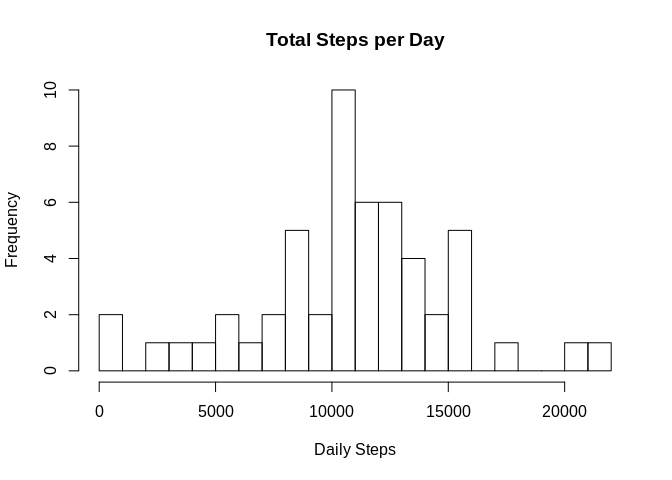
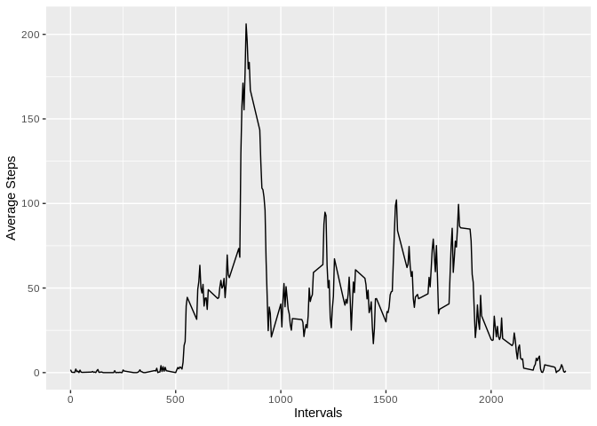
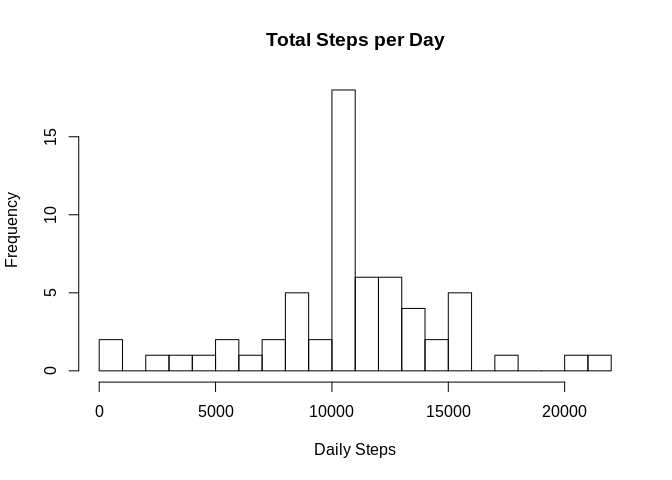
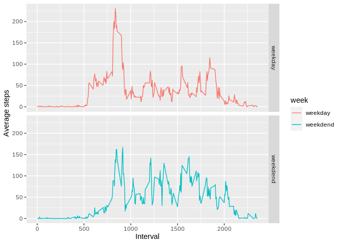

## Loading and preprocessing the data

```r
library(dplyr)
```

```
## 
## Attaching package: 'dplyr'
```

```
## The following objects are masked from 'package:stats':
## 
##     filter, lag
```

```
## The following objects are masked from 'package:base':
## 
##     intersect, setdiff, setequal, union
```

```r
## First we need to unzip the data
if(!file.exists("activity.csv")){
    unzip("activity.zip")
}

## Load data
data <- read.csv("activity.csv")
```


## What is mean total number of steps taken per day?
1. Calculate the total number of steps taken per day

```r
steps_by_day <- data %>% group_by(date) %>% summarise(total.steps = sum(steps)) %>% na.omit()
```

```
## `summarise()` ungrouping output (override with `.groups` argument)
```

```r
head(steps_by_day)
```

```
## # A tibble: 6 x 2
##   date       total.steps
##   <fct>            <int>
## 1 2012-10-02         126
## 2 2012-10-03       11352
## 3 2012-10-04       12116
## 4 2012-10-05       13294
## 5 2012-10-06       15420
## 6 2012-10-07       11015
```

2. Make a histogram of the total number of steps taken each day

```r
hist(steps_by_day$total.steps, xlab="Daily Steps", main = "Total Steps per Day", breaks = 30)
```

<!-- -->

3. Calculate and report the mean and median of the total number of steps taken per day

```r
mean_median <- steps_by_day %>% summarise(mean = mean(total.steps), median = median(total.steps))
print(mean_median)
```

```
## # A tibble: 1 x 2
##     mean median
##    <dbl>  <int>
## 1 10766.  10765
```


## What is the average daily activity pattern?

1. Make a time series plot (i.e. type = "l") of the 5-minute interval (x-axis) and the average number of steps taken, averaged across all days (y-axis)

```r
library(ggplot2)
steps_interval <- data %>% group_by(interval) %>% na.omit() %>% summarise(msteps = mean(steps))
```

```
## `summarise()` ungrouping output (override with `.groups` argument)
```

```r
g <- ggplot(steps_interval, aes(x = interval, y = msteps))
g + geom_line() + labs(x = "Intervals" , y = "Average Steps")
```

<!-- -->

2. Which 5-minute interval, on average across all the days in the dataset, contains the maximum number of steps?

```r
indice <- which.max(steps_interval$msteps)
steps_interval$interval[indice]
```

```
## [1] 835
```


## Imputing missing values
1. Calculate and report the total number of missing values in the dataset (i.e. the total number of rows with NAs)

```r
sum(is.na(data))
```

```
## [1] 2304
```

2. Devise a strategy for filling in all of the missing values in the dataset. The strategy does not need to be sophisticated. For example, you could use the mean/median for that day, or the mean for that 5-minute interval, etc.
3. Create a new dataset that is equal to the original dataset but with the missing data filled in.

```r
## here we'll fill up the NAs with the man by 5-minute interval.
## First we create a function will receive each group of steps by interval and replace the
## NAs with the mean, and set to a new dataframe called new_data

my_replace <- function(x){
    replace(x, is.na(x), mean(x, na.rm = TRUE))
}
new_data <- data %>% group_by(interval) %>% mutate(steps = my_replace(steps))
```

4. Make a histogram of the total number of steps taken each day and Calculate and report the mean and median total number of steps taken per day. Do these values differ from the estimates from the first part of the assignment? What is the impact of imputing missing data on the estimates of the total daily number of steps?

```r
new_steps_by_day <- new_data %>% group_by(date) %>% summarise(total.steps = sum(steps))
```

```
## `summarise()` ungrouping output (override with `.groups` argument)
```

```r
hist(new_steps_by_day$total.steps, xlab = "Daily Steps", main = "Total Steps per Day", breaks = 30)
```

<!-- -->

```r
### Comparing the new mean and median with NA's filled up
new_mean_median <- new_steps_by_day %>% summarise(mean=mean(total.steps), median=median(total.steps))

print(paste0("Mean with na's = ", round(mean_median[1]), ". Mean with no na's = ", round(new_mean_median[1])))
```

```
## [1] "Mean with na's = 10766. Mean with no na's = 10766"
```

```r
print(paste0("Median with na's = ", mean_median[2], ". Median with no na's = ", round(new_mean_median[2])))
```

```
## [1] "Median with na's = 10765. Median with no na's = 10766"
```

## Are there differences in activity patterns between weekdays and weekends?
1. Create a new factor variable in the dataset with two levels – “weekday” and “weekend” indicating whether a given date is a weekday or weekend day.

```r
new_data$date <- as.Date(as.character(new_data$date), format = "%Y-%m-%d")
new_data$week <- weekdays(new_data$date)
new_data$week <- ifelse(new_data$week == "sábado" | new_data$week == "domingo", "weekdend", "weekday")
new_data$week <- as.factor(new_data$week)
head(new_data)
```

```
## # A tibble: 6 x 4
## # Groups:   interval [6]
##    steps date       interval week   
##    <dbl> <date>        <int> <fct>  
## 1 1.72   2012-10-01        0 weekday
## 2 0.340  2012-10-01        5 weekday
## 3 0.132  2012-10-01       10 weekday
## 4 0.151  2012-10-01       15 weekday
## 5 0.0755 2012-10-01       20 weekday
## 6 2.09   2012-10-01       25 weekday
```

2. Make a panel plot containing a time series plot (i.e. type = "l"\color{red}{\verb|type = "l"|}type = "l") of the 5-minute interval (x-axis) and the average number of steps taken, averaged across all weekday days or weekend days (y-axis). See the README file in the GitHub repository to see an example of what this plot should look like using simulated data.

```r
weekday_comparison <- new_data %>% group_by(interval, week) %>% summarise(msteps = mean(steps))
```

```
## `summarise()` regrouping output by 'interval' (override with `.groups` argument)
```

```r
g <- ggplot(weekday_comparison, aes(x = interval, y = msteps, color = week))
g + geom_line() + facet_grid(week ~ .) + labs(x = "Interval", y = "Average steps")
```

<!-- -->
